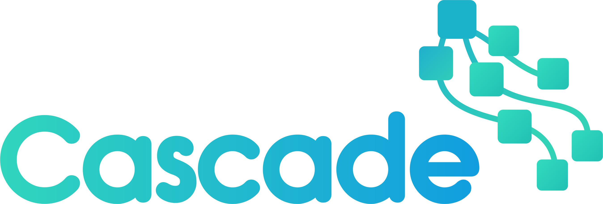
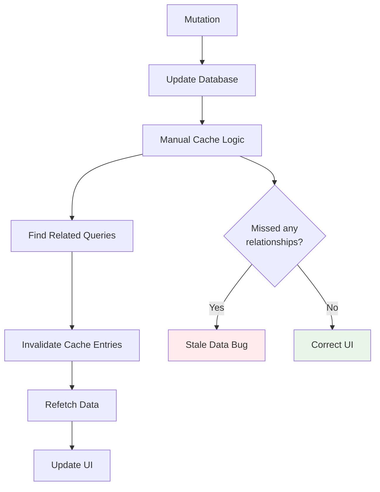
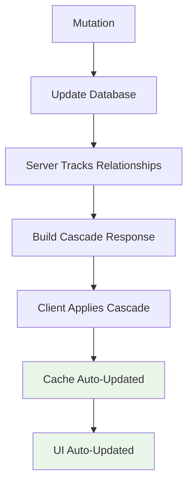
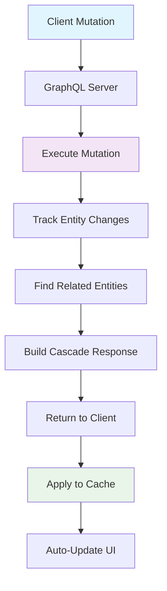
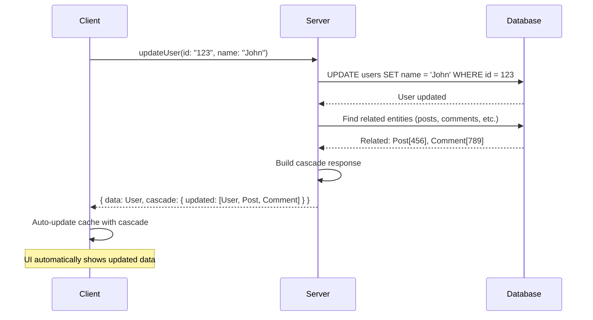
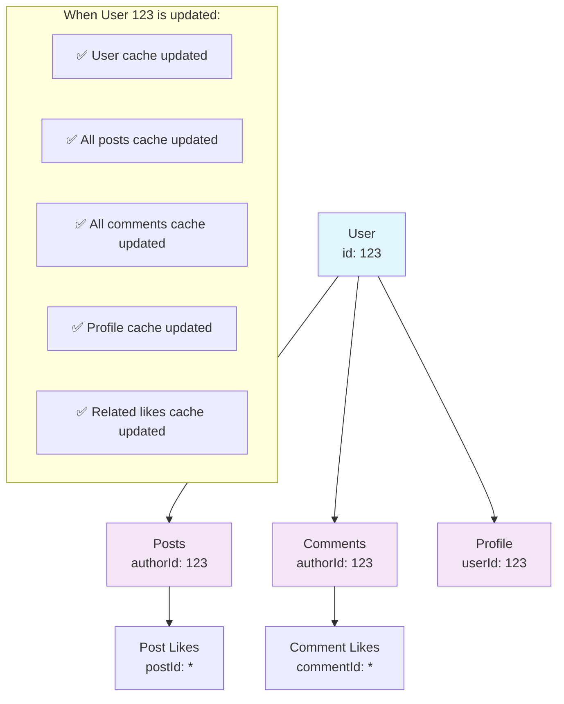

# GraphQL Cascade

<p align="center">
  
</p>

[](https://opensource.org/licenses/MIT)
[](./specification/)

**Cascading cache updates for GraphQL** - Automatic, intelligent cache invalidation that cascades through your entire data graph.

## Overview

GraphQL Cascade solves the cache invalidation problem by automatically tracking entity relationships and cascading invalidations through your data graph. When you mutate data, related cache entries are automatically invalidated and refetched, ensuring your UI stays consistent without manual cache management.

## Problem

GraphQL caching is hard. When you mutate data, you need to manually invalidate all related cache entries across your entire application. This leads to:

- **Stale data** - Cache entries become outdated after mutations
- **Complex invalidation logic** - Developers must track all relationships manually
- **Race conditions** - Multiple mutations can conflict
- **Poor UX** - Users see inconsistent data states

### Manual Cache Management (Traditional)



### Automatic Cache Management (GraphQL Cascade)



## Solution

GraphQL Cascade automatically tracks entity relationships and cascades cache invalidations through your data graph. When you update a user, all related posts, comments, and notifications are automatically invalidated.

### How It Works



### Cascade Flow Example



### Entity Relationship Tracking

GraphQL Cascade automatically discovers and tracks entity relationships to ensure complete cache invalidation:



### Before GraphQL Cascade
```javascript
// Manual cache invalidation - error prone and incomplete
const updateUser = async (userId, updates) => {
  await mutate({ variables: { userId, updates } });

  // Manually invalidate all related cache entries
  cache.evict({ fieldName: 'user', args: { id: userId } });
  cache.evict({ fieldName: 'posts', args: { authorId: userId } });
  cache.evict({ fieldName: 'comments', args: { authorId: userId } });
  cache.evict({ fieldName: 'notifications', args: { userId } });
  // ... and many more - easy to miss some!
};
```

### After GraphQL Cascade
```javascript
// Automatic cascading invalidation
const updateUser = async (userId, updates) => {
  await mutate({ variables: { userId, updates } });
  // Cache automatically cascades through all relationships!
};
```

## Quick Start

### Server (Python)

```bash
pip install graphql-cascade
```

### Client (TypeScript)

```bash
npm install @graphql-cascade/client
# Or with Apollo
npm install @graphql-cascade/client @graphql-cascade/client-apollo
```

## Getting Started

- **[Quick Start Guide](./docs/getting-started/quick-start.md)** - 5-minute setup
- **[Concepts](./docs/getting-started/concepts.md)** - Core concepts explained
- **[First Cascade](./docs/getting-started/first-cascade.md)** - Build your first implementation

## Documentation

- **[Specification](./specification/)** - Complete technical specification
- **[Guides](./docs/guides/)** - Implementation guides for different frameworks
- **[API Reference](./docs/api/)** - Complete API documentation
- **[Examples](./examples/)** - Working examples for different use cases

## Examples

- **[Todo App](./examples/todo-app/)** - Simple CRUD with cascades
- **[Blog Platform](./examples/blog-platform/)** - Complex relationships
- **[Real-time Collaboration](./examples/real-time-collab/)** - Subscriptions with cascades

## Community

- **GitHub Discussions**: Ask questions and share ideas
- **Contributing**: See our [contribution guide](./CONTRIBUTING.md)

## Status

🚧 **Early Development** - Specification and reference implementations available. Production-ready packages coming soon.

- ✅ Core specification complete
- ✅ Python/FraiseQL server implementation
- ✅ Apollo Client integration
- 🚧 React Query integration (in progress)
- 🚧 Relay integration (planned)

## License

MIT License - see [LICENSE](./LICENSE) for details.
