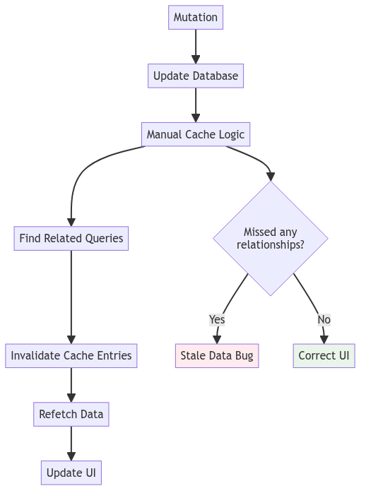
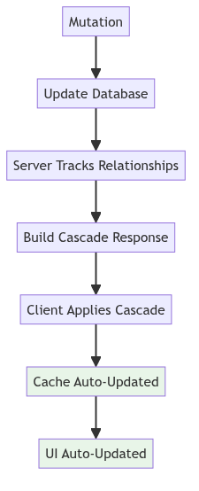
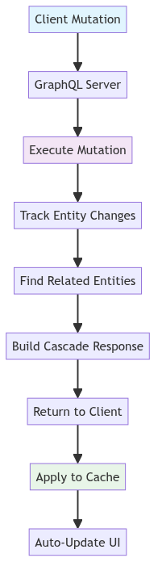
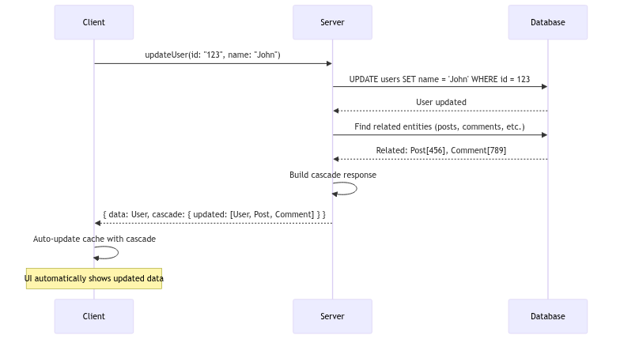
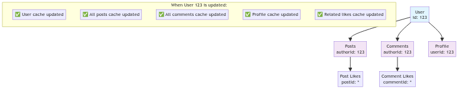

# GraphQL Cascade

<p align="center">
  
</p>

[](https://opensource.org/licenses/MIT)
[](./specification/)

**Cascading cache updates for GraphQL** - Automatic, intelligent cache invalidation that cascades through your entire data graph.

## Overview

GraphQL Cascade solves the cache invalidation problem by automatically tracking entity relationships and cascading invalidations through your data graph. When you mutate data, related cache entries are automatically invalidated and refetched, ensuring your UI stays consistent without manual cache management.

## Problem

GraphQL caching is hard. When you mutate data, you need to manually invalidate all related cache entries across your entire application. This leads to:

- **Stale data** - Cache entries become outdated after mutations
- **Complex invalidation logic** - Developers must track all relationships manually
- **Race conditions** - Multiple mutations can conflict
- **Poor UX** - Users see inconsistent data states

### Manual Cache Management (Traditional)

<p align="center">
  
</p>

### Automatic Cache Management (GraphQL Cascade)

<p align="center">
  
</p>

## Solution

GraphQL Cascade automatically tracks entity relationships and cascades cache invalidations through your data graph. When you update a user, all related posts, comments, and notifications are automatically invalidated.

### How It Works

<p align="center">
  
</p>

### Cascade Flow Example

<p align="center">
  
</p>

### Entity Relationship Tracking

GraphQL Cascade automatically discovers and tracks entity relationships to ensure complete cache invalidation:

<p align="center">
  
</p>

### Before GraphQL Cascade
```javascript
// Manual cache invalidation - error prone and incomplete
const updateUser = async (userId, updates) => {
  await mutate({ variables: { userId, updates } });

  // Manually invalidate all related cache entries
  cache.evict({ fieldName: 'user', args: { id: userId } });
  cache.evict({ fieldName: 'posts', args: { authorId: userId } });
  cache.evict({ fieldName: 'comments', args: { authorId: userId } });
  cache.evict({ fieldName: 'notifications', args: { userId } });
  // ... and many more - easy to miss some!
};
```

### After GraphQL Cascade
```javascript
// Automatic cascading invalidation
const updateUser = async (userId, updates) => {
  await mutate({ variables: { userId, updates } });
  // Cache automatically cascades through all relationships!
};
```

## Quick Start

### Server (TypeScript/Node.js)

```bash
npm install @graphql-cascade/server
```

```typescript
import { CascadeTracker, CascadeBuilder } from '@graphql-cascade/server';

// Create tracker and builder
const tracker = new CascadeTracker();
const builder = new CascadeBuilder(tracker);

// In your mutation resolver
const transactionId = tracker.startTransaction();
tracker.trackUpdate({ id: userId, __typename: 'User', name: 'John' });
const response = builder.buildResponse(mutationResult);
// Response includes cascade data for automatic cache updates
```

### Client (Apollo)

```bash
npm install @graphql-cascade/client-apollo @apollo/client
```

```typescript
import { ApolloClient, InMemoryCache } from '@apollo/client';
import { ApolloCascadeClient } from '@graphql-cascade/client-apollo';

const client = new ApolloClient({
  uri: 'http://localhost:4000/graphql',
  cache: new InMemoryCache()
});

const cascade = new ApolloCascadeClient(client);

// Mutations automatically update the cache!
const result = await cascade.mutate(UPDATE_USER, { id: '123', name: 'John' });
```

## Packages

| Package | Description |
|---------|-------------|
| [@graphql-cascade/server](./packages/server-node) | Server implementation for Node.js/TypeScript |
| [@graphql-cascade/client-apollo](./packages/client-apollo) | Apollo Client integration |
| [@graphql-cascade/client-react-query](./packages/client-react-query) | React Query integration |
| [@graphql-cascade/client-relay](./packages/client-relay) | Relay Modern integration |
| [@graphql-cascade/client-urql](./packages/client-urql) | URQL integration |
| [@graphql-cascade/cli](./packages/cli) | CLI tools for development and debugging |
| [@graphql-cascade/conformance](./packages/conformance) | Conformance test suite |

## Documentation

- **[Guide](./docs/guide/)** - Getting started and core concepts
- **[Server Documentation](./docs/server/)** - Server implementation guides
- **[Client Documentation](./docs/clients/)** - Client library guides
- **[CLI Documentation](./docs/cli/)** - Command-line tools
- **[Specification](./docs/specification/)** - Technical specification
- **[API Reference](./docs/api/)** - Complete API documentation

## Community

- **GitHub Discussions**: Ask questions and share ideas
- **Contributing**: See our [contribution guide](./CONTRIBUTING.md)

## Status

- ✅ Core specification complete
- ✅ TypeScript server implementation
- ✅ Apollo Client integration
- ✅ React Query integration
- ✅ Relay integration
- ✅ URQL integration
- ✅ CLI tools
- ✅ Conformance test suite

## License

MIT License - see [LICENSE](./LICENSE) for details.
