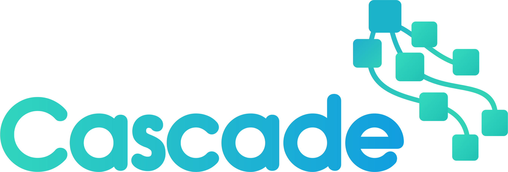
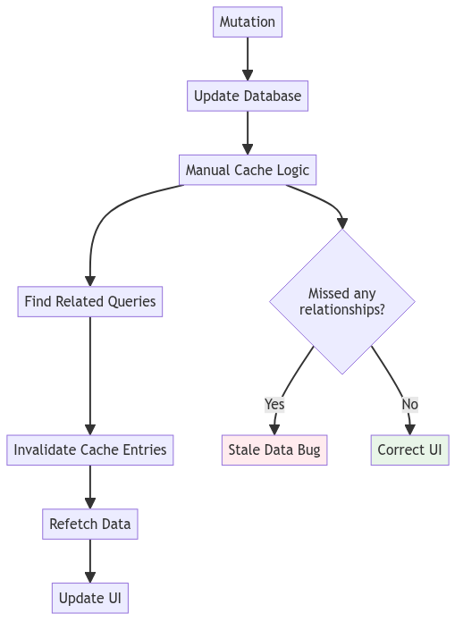
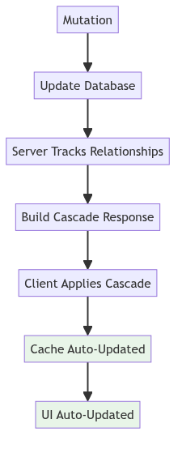
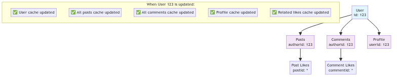

# GraphQL Cascade

<p align="center">
  
</p>

<p align="center">
  <a href="https://github.com/graphql-cascade/graphql-cascade/actions/workflows/ci.yml">
    
  </a>
  <a href="https://github.com/graphql-cascade/graphql-cascade/actions/workflows/codeql.yml">
    
  </a>
  <a href="https://codecov.io/gh/graphql-cascade/graphql-cascade">
    
  </a>
  <a href="https://www.npmjs.com/package/@graphql-cascade/server">
    
  </a>
  <a href="https://www.npmjs.com/package/@graphql-cascade/server">
    
  </a>
  <a href="https://opensource.org/licenses/MIT">
    
  </a>
  <a href="./specification/">
    
  </a>
  <a href="https://github.com/graphql-cascade/graphql-cascade/issues">
    
  </a>
  <a href="https://github.com/graphql-cascade/graphql-cascade/blob/main/CONTRIBUTING.md">
    
  </a>
</p>

**Automatic cache consistency for GraphQL** - Servers return all affected entities in mutation responses, eliminating the need for clients to guess which queries to refetch.

## Overview

GraphQL Cascade solves the cache consistency problem by having **servers return all affected entities in mutation responses**. Instead of clients manually invalidating queries and refetching, the server tells you exactly what changed. This makes cache updates automatic, predictable, and impossible to miss.

## Problem

When mutations have side effects across multiple entities, clients don't know which queries to refetch.

**Example:** User creates a post

```
Backend mutation updates:
  ✓ posts table (new row)
  ✓ users.postCount (aggregate)
  ✓ creates notifications (for followers)
  ✓ affects trending rankings
  ✓ affects user's timeline

Client currently must guess:
  "Do I need to refetch getUserPosts?"  ← Maybe
  "What about getNotifications?"       ← Maybe
  "What about postCount?"              ← Maybe
  "What about trending?"               ← Maybe
  → Must refetch multiple queries, guessing what's affected
  → Easy to miss something and show stale data
```

Without Cascade, this forces clients to:
- **Manually track all side effects** - Error-prone and brittle
- **Refetch multiple queries** - Slow and wastes bandwidth
- **Show stale data** - When a refetch is forgotten
- **Create race conditions** - Multiple mutations conflicting

### Manual Cache Management (Traditional)

<p align="center">
  
</p>

### Automatic Cache Management (GraphQL Cascade)

<p align="center">
  
</p>

## Solution

GraphQL Cascade solves this by having **servers include all affected entities in the mutation response**. No manual invalidation, no refetching, no guessing.

```
User creates post:
  ↓
Server mutation executes
  ↓
Server discovers what changed:
  - Post created
  - User.postCount updated
  - Notifications created
  ↓
Server returns ALL of this in one response
  ↓
Client receives everything at once → Cache is complete
```

### How It Works

**Without Cascade:** Mutation returns only the direct result. Client must guess what else changed.

```graphql
mutation CreatePost($input: CreatePostInput!) {
  createPost(input: $input) {
    post {
      id
      title
      content
    }
    # Client has no idea if this affected postCount, notifications, trending posts, etc.
  }
}
```

**With Cascade:** Mutation returns everything that changed, using proper GraphQL unions.

```graphql
mutation CreatePost($input: CreatePostInput!) {
  createPost(input: $input) {
    # The primary mutation result
    post {
      id
      title
      content
      authorId
    }

    # Everything affected by this mutation (in one response!)
    cascade {
      updated {
        __typename
        # Updated aggregates and relationships
        ... on User {
          id
          postCount          # ← This changed
          lastPostAt         # ← This changed
        }
        # New data created
        ... on Notification {
          id
          message
          recipientId
          createdAt
        }
      }
    }
  }
}
```

**The Result:** Client receives everything in one GraphQL response. No refetching, no guessing.

### Before GraphQL Cascade
```javascript
// Client must manually track what to refetch
const createPost = async (input) => {
  const result = await client.mutate({
    mutation: CREATE_POST,
    variables: input
  });

  // Which queries are affected? Developer must know:
  // - postCount changed (yes)
  // - notifications changed (yes)
  // - user.posts changed (yes)
  // - trending posts changed (maybe)
  // - followers' timelines changed (probably)

  // Manual refetching required
  await client.refetchQueries({
    include: [getUserPosts, getNotifications, getUser]
    // Easy to miss affected queries → stale data
  });
};
```

### After GraphQL Cascade
```javascript
// Server tells client exactly what changed
const createPost = async (input) => {
  const result = await client.mutate({
    mutation: CREATE_POST,
    variables: input
  });

  // Cascade data is in the response - everything that changed
  const { cascade } = result.data.createPost;

  // Update cache with all affected entities
  cascade.updated.forEach(entity => {
    client.cache.modify({
      fields: {
        [entity.__typename.toLowerCase()](existing) {
          return entity;  // Update with latest data from server
        }
      }
    });
  });

  // ✅ No refetching, no guessing, no stale data
};
```

### Entity Relationship Tracking

GraphQL Cascade automatically discovers and tracks entity relationships to ensure complete cache updates:

<p align="center">
  
</p>

## Quick Start

### Server Implementation

Server implementations vary by framework. Here's a TypeScript/Node.js example with Apollo Server:

```bash
npm install @graphql-cascade/server
```

```typescript
// schema.ts - Define cascade response types
type CascadeEntity = User | Post | Notification;

type CreatePostPayload {
  post: Post!
  cascade: CascadeResponse!
}

type CascadeResponse {
  updated: [CascadeEntity!]!
  deleted: [CascadeEntity!]
}

// resolvers.ts - Implement cascade tracking
import { createCascadeBuilder } from '@graphql-cascade/server';

const resolvers = {
  Mutation: {
    async createPost(_, { input }, { db }) {
      // Create post
      const post = await db.posts.create({
        title: input.title,
        content: input.content,
        authorId: input.authorId
      });

      // Get affected user
      const user = await db.users.findById(input.authorId);

      // Build cascade response - server tells client what changed
      const cascade = createCascadeBuilder();

      // User's postCount changed
      cascade.addUpdated('User', {
        id: user.id,
        postCount: user.posts.length,
        lastPostAt: new Date()
      });

      // Create notifications for followers
      const followers = await db.users.getFollowersOf(input.authorId);
      followers.forEach(follower => {
        cascade.addCreated('Notification', {
          id: crypto.randomUUID(), // Use your preferred ID strategy (uuid, nanoid, etc.)
          recipientId: follower.id,
          message: `${user.name} posted something new`,
          createdAt: new Date()
        });
      });

      return {
        post,
        cascade: cascade.build()
      };
    }
  }
};
```

### Client (Apollo)

```bash
npm install @apollo/client
```

```typescript
import { useMutation, gql, ApolloClient, InMemoryCache } from '@apollo/client';

const CREATE_POST = gql`
  mutation CreatePost($input: CreatePostInput!) {
    createPost(input: $input) {
      post {
        id
        title
        content
        authorId
      }
      cascade {
        updated {
          __typename
          ... on User {
            id
            postCount
            lastPostAt
          }
          ... on Notification {
            id
            message
            recipientId
            createdAt
          }
        }
      }
    }
  }
`;

function CreatePostButton() {
  const client = useApolloClient(); // Apollo Client from ApolloProvider context

  const [createPost, { loading }] = useMutation(CREATE_POST, {
    onCompleted: (data) => {
      const { cascade } = data.createPost;

      // Server told us what changed - update cache automatically
      cascade.updated.forEach(entity => {
        client.cache.modify({
          fields: {
            user(existing = {}, { readField }) {
              // Update user fields if this is a User entity
              if (entity.__typename === 'User' && entity.id === readField('id', existing)) {
                return { ...existing, ...entity };
              }
              return existing;
            },
            notifications(existing = [], { readField }) {
              // Add new notifications if this is a Notification entity
              if (entity.__typename === 'Notification') {
                return [...existing, entity];
              }
              return existing;
            }
          }
        });
      });
    }
  });

  const handleClick = async () => {
    await createPost({
      variables: {
        input: {
          title: 'New Post',
          content: 'Hello world',
          authorId: 'user-123'
        }
      }
    });
  };

  return <button onClick={handleClick} disabled={loading}>Create Post</button>;
}
```

### Client (React Query)

```bash
npm install @tanstack/react-query
```

```typescript
import { useMutation, useQueryClient } from '@tanstack/react-query';
import { GraphQLClient, gql } from 'graphql-request';

// Initialize GraphQL client
const graphqlClient = new GraphQLClient('http://localhost:4000/graphql');

const CREATE_POST = gql`
  mutation CreatePost($input: CreatePostInput!) {
    createPost(input: $input) {
      post { id, title, content, authorId }
      cascade {
        updated {
          __typename
          ... on User { id, postCount, lastPostAt }
          ... on Notification { id, message, recipientId, createdAt }
        }
      }
    }
  }
`;

function CreatePostButton() {
  const queryClient = useQueryClient();

  const mutation = useMutation({
    mutationFn: async (input) => {
      const response = await graphqlClient.request(CREATE_POST, { input });
      return response.createPost;
    },
    onSuccess: (data) => {
      const { cascade } = data;

      // Server told us exactly what changed
      cascade.updated.forEach(entity => {
        if (entity.__typename === 'User') {
          // Invalidate and refetch user-related queries
          queryClient.setQueryData(['user', entity.id], entity);
        } else if (entity.__typename === 'Notification') {
          // Update notifications cache
          queryClient.setQueryData(['notifications'], (old = []) => [...old, entity]);
        }
      });
    }
  });

  return (
    <button
      onClick={() => mutation.mutate({
        title: 'New Post',
        content: 'Hello world',
        authorId: 'user-123'
      })}
      disabled={mutation.isPending}
    >
      Create Post
    </button>
  );
}
```

## TypeScript Code Generation

Get full type safety with automatic TypeScript code generation:

```bash
# Initialize codegen configuration
npx cascade codegen init

# Install dependencies
npm install -D @graphql-codegen/cli @graphql-codegen/typescript @graphql-codegen/typescript-operations @graphql-cascade/codegen

# Generate types
npx cascade codegen
```

**Before codegen:**
```typescript
const [createTodo] = useCascadeMutation(CREATE_TODO);
//    ^ any type, no autocomplete
```

**After codegen:**
```typescript
import { CreateTodoDocument, CreateTodoMutation } from './generated/graphql';

const [createTodo] = useCascadeMutation<CreateTodoMutation>(CreateTodoDocument);
//    ^ Fully typed with IDE autocomplete for cascade updates!

const result = await createTodo({ variables: { title: 'New Todo' } });
result.cascade.updated.forEach(entity => {
  // Full type safety on cascade data
  console.log(`Updated ${entity.__typename}`);
});
```

The codegen plugin automatically generates:
- Type-safe mutation and query types
- Cascade helper types (`CascadeOf<T>`, `DataOf<T>`)
- Union type guards for error handling
- Pre-configured `UnionCascadeConfig` objects

See [@graphql-cascade/codegen](./packages/codegen) for full documentation.

## Packages

| Package | Description |
|---------|-------------|
| [@graphql-cascade/server](./packages/server-node) | Server implementation for Node.js/TypeScript |
| [@graphql-cascade/client-apollo](./packages/client-apollo) | Apollo Client integration |
| [@graphql-cascade/client-react-query](./packages/client-react-query) | React Query integration |
| [@graphql-cascade/client-relay](./packages/client-relay) | Relay Modern integration |
| [@graphql-cascade/client-urql](./packages/client-urql) | URQL integration |
| [@graphql-cascade/codegen](./packages/codegen) | TypeScript code generation plugin |
| [@graphql-cascade/cli](./packages/cli) | CLI tools for development and debugging |
| [@graphql-cascade/conformance](./packages/conformance) | Conformance test suite |

## Documentation

- **[Guide](./docs/guide/)** - Getting started and core concepts
- **[Server Documentation](./docs/server/)** - Server implementation guides
- **[Client Documentation](./docs/clients/)** - Client library guides
- **[CLI Documentation](./docs/cli/)** - Command-line tools
- **[Specification](./docs/specification/)** - Technical specification
- **[API Reference](./docs/api/)** - Complete API documentation

## Community

- **GitHub Discussions**: Ask questions and share ideas
- **Contributing**: See our [contribution guide](./CONTRIBUTING.md)

## Status

- ✅ Core specification complete
- ✅ TypeScript server implementation
- ✅ Apollo Client integration
- ✅ React Query integration
- ✅ Relay integration
- ✅ URQL integration
- ✅ CLI tools
- ✅ Conformance test suite

## License

MIT License - see [LICENSE](./LICENSE) for details.
