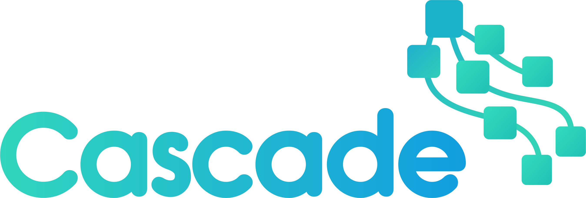
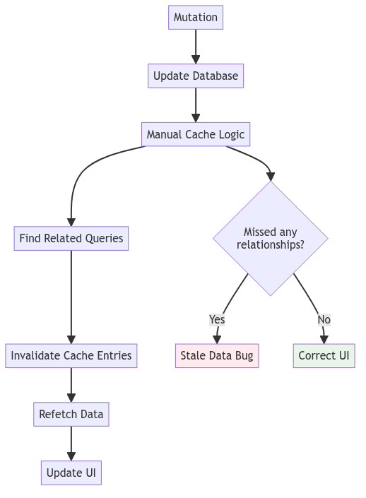
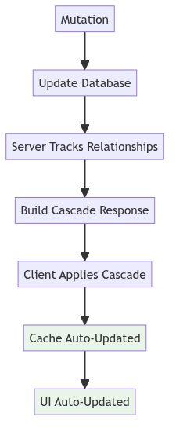
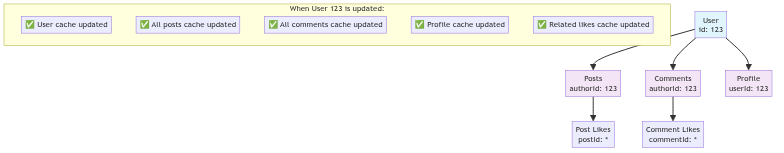

# GraphQL Cascade

<p align="center">
  
</p>

<p align="center">
  <a href="https://github.com/graphql-cascade/graphql-cascade/actions/workflows/ci.yml">
    
  </a>
  <a href="https://github.com/graphql-cascade/graphql-cascade/actions/workflows/codeql.yml">
    
  </a>
  <a href="https://codecov.io/gh/graphql-cascade/graphql-cascade">
    
  </a>
  <a href="https://www.npmjs.com/package/@graphql-cascade/server">
    
  </a>
  <a href="https://www.npmjs.com/package/@graphql-cascade/server">
    
  </a>
  <a href="https://opensource.org/licenses/MIT">
    
  </a>
  <a href="./specification/">
    
  </a>
  <a href="https://github.com/graphql-cascade/graphql-cascade/issues">
    
  </a>
  <a href="https://github.com/graphql-cascade/graphql-cascade/blob/main/CONTRIBUTING.md">
    
  </a>
</p>

**Automatic cache consistency for GraphQL** - Servers return all affected entities in mutation responses, eliminating the need for clients to guess which queries to refetch.

## Overview

GraphQL Cascade solves the cache consistency problem by having **servers return all affected entities in mutation responses**. Instead of clients manually invalidating queries and refetching, the server tells you exactly what changed. This makes cache updates automatic, predictable, and impossible to miss.

## Problem

When mutations have side effects across multiple entities, clients don't know which queries to refetch.

**Example:** User creates a post

```
Backend mutation updates:
  ✓ posts table (new row)
  ✓ users.postCount (aggregate)
  ✓ creates notifications (for followers)
  ✓ affects trending rankings
  ✓ affects user's timeline

Client currently must guess:
  "Do I need to refetch getUserPosts?"  ← Maybe
  "What about getNotifications?"       ← Maybe
  "What about postCount?"              ← Maybe
  "What about trending?"               ← Maybe
  → Must refetch multiple queries, guessing what's affected
  → Easy to miss something and show stale data
```

Without Cascade, this forces clients to:
- **Manually track all side effects** - Error-prone and brittle
- **Refetch multiple queries** - Slow and wastes bandwidth
- **Show stale data** - When a refetch is forgotten
- **Create race conditions** - Multiple mutations conflicting

### Manual Cache Management (Traditional)

<figure style="text-align: center; margin: 2rem 0;">
  
  <figcaption style="font-size: 0.9em; color: #666; margin-top: 0.5rem;">Traditional approach: Client must manually guess and refetch affected queries</figcaption>
</figure>

### Automatic Cache Management (GraphQL Cascade)

<figure style="text-align: center; margin: 2rem 0;">
  
  <figcaption style="font-size: 0.9em; color: #666; margin-top: 0.5rem;">GraphQL Cascade: Server returns all affected entities in one response</figcaption>
</figure>

## Solution

GraphQL Cascade solves this by having **servers include all affected entities in the mutation response**. No manual invalidation, no refetching, no guessing.

```
User creates post:
  ↓
Server mutation executes
  ↓
Server discovers what changed:
  - Post created
  - User.postCount updated
  - Notifications created
  ↓
Server returns ALL of this in one response
  ↓
Client receives everything at once → Cache is complete
```

### How It Works

**Without Cascade:** Mutation returns only the direct result. Client must guess what else changed.

```graphql
mutation CreatePost($input: CreatePostInput!) {
  createPost(input: $input) {
    post {
      id
      title
      content
    }
    # Client has no idea if this affected postCount, notifications, trending posts, etc.
  }
}
```

**With Cascade:** Mutation returns everything that changed, each entry naming its type and carrying the entity's full data.

```graphql
mutation CreatePost($input: CreatePostInput!) {
  createPost(input: $input) {
    # The primary mutation result
    data { id title content authorId }

    # Everything affected by this mutation, in one response
    cascade {
      updated {
        typename          # "Post", "User", "Notification"
        id
        operation         # CREATED, UPDATED or DELETED
        entity {
          id
          ... on User { postCount lastPostAt }        # ← changed
          ... on Notification { message recipientId } # ← created
        }
      }
      deleted { typename id }
    }
  }
}
```

**The Result:** Client receives everything in one GraphQL response. No refetching, no guessing.

### Before GraphQL Cascade
```javascript
// Client must manually track what to refetch
const createPost = async (input) => {
  const result = await client.mutate({
    mutation: CREATE_POST,
    variables: input
  });

  // Which queries are affected? Developer must know:
  // - postCount changed (yes)
  // - notifications changed (yes)
  // - user.posts changed (yes)
  // - trending posts changed (maybe)
  // - followers' timelines changed (probably)

  // Manual refetching required
  await client.refetchQueries({
    include: [getUserPosts, getNotifications, getUser]
    // Easy to miss affected queries → stale data
  });
};
```

### After GraphQL Cascade
```javascript
// The cascade in the response updates the cache: every affected entity is
// written in place, so every query that shows it is current
const [createPost] = useCascadeMutation(CREATE_POST);

await createPost({ variables: input });
// ✅ No refetching, no guessing, no stale data
```

### Entity Relationship Tracking

GraphQL Cascade automatically discovers and tracks entity relationships to ensure complete cache updates:

<figure style="text-align: center; margin: 2rem 0;">
  
  <figcaption style="font-size: 0.9em; color: #666; margin-top: 0.5rem;">Cascade automatically discovers entity relationships for complete cache invalidation</figcaption>
</figure>

## Quick Start

### Server

Add the core types from [`reference/cascade_base.graphql`](reference/cascade_base.graphql) to your schema, and return a payload that implements `CascadeResponse`:

```graphql
type CreatePostCascade implements CascadeResponse {
  success: Boolean!
  errors: [CascadeError!]
  data: Post
  cascade: CascadeUpdates!
}

type Mutation {
  createPost(input: CreatePostInput!): CreatePostCascade!
}
```

Track what the mutation changes, and build the response:

```bash
npm install @graphql-cascade/server
```

```typescript
import { CascadeBuilder, CascadeTracker } from "@graphql-cascade/server";

const resolvers = {
  Mutation: {
    async createPost(_, { input }, { db }) {
      const tracker = new CascadeTracker();
      tracker.startTransaction();

      const post = await db.posts.create(input);
      tracker.trackCreate({ __typename: "Post", ...post });

      // The author's post count changed too
      const author = await db.users.findById(input.authorId);
      tracker.trackUpdate({ __typename: "User", ...author });

      return new CascadeBuilder(tracker).buildResponse(post);
    },
  },
};
```

The response lists the new post and the updated author in `cascade.updated`, with their full data.

### Client (Apollo)

```bash
npm install @graphql-cascade/apollo @apollo/client
```

```tsx
import { gql } from "@apollo/client";
import { useCascadeMutation } from "@graphql-cascade/apollo";

const CREATE_POST = gql`
  mutation CreatePost($input: CreatePostInput!) {
    createPost(input: $input) {
      success
      data { id title }
      cascade {
        updated {
          typename
          id
          operation
          entity {
            id
            ... on Post { title authorId }
            ... on User { postCount }
          }
        }
        deleted { typename id }
        invalidations { queryName strategy scope }
        typeInvalidations { typename }
        metadata { timestamp affectedCount truncated }
      }
    }
  }
`;

function CreatePostButton() {
  // Applies the cascade to Apollo's cache: the new post and the author's
  // post count appear in every query that shows them, without a refetch.
  const [createPost, { loading }] = useCascadeMutation(CREATE_POST);

  return (
    <button
      disabled={loading}
      onClick={() => createPost({ variables: { input: { title: "Hello", authorId: "user-123" } } })}
    >
      Create Post
    </button>
  );
}
```

### Client (React Query)

```bash
npm install @graphql-cascade/react-query @tanstack/react-query graphql-request
```

```tsx
import { useQueryClient } from "@tanstack/react-query";
import { GraphQLClient } from "graphql-request";
import {
  ReactQueryCascadeClient,
  useCascadeMutation,
} from "@graphql-cascade/react-query";

const graphql = new GraphQLClient("http://localhost:4000/graphql");

function CreatePostButton() {
  const queryClient = useQueryClient();
  const cascadeClient = new ReactQueryCascadeClient(queryClient, (query, variables) =>
    graphql.request(query, variables).then((data) => ({ data })),
  );

  // Same CREATE_POST document as above; the cascade updates cached queries
  const mutation = useCascadeMutation(cascadeClient, CREATE_POST);

  return (
    <button
      disabled={mutation.isPending}
      onClick={() => mutation.mutate({ input: { title: "Hello", authorId: "user-123" } })}
    >
      Create Post
    </button>
  );
}
```

## TypeScript Code Generation

Get full type safety with automatic TypeScript code generation:

```bash
# Initialize codegen configuration
npx cascade codegen init

# Install dependencies
npm install -D @graphql-codegen/cli @graphql-codegen/typescript @graphql-codegen/typescript-operations @graphql-cascade/codegen

# Generate types
npx cascade codegen
```

**Before codegen:**
```typescript
const [createTodo] = useCascadeMutation(CREATE_TODO);
//    ^ any type, no autocomplete
```

**After codegen:**
```typescript
import { CreateTodoDocument, CreateTodoMutation } from './generated/graphql';

const [createTodo] = useCascadeMutation<CreateTodoMutation>(CreateTodoDocument);
//    ^ Fully typed with IDE autocomplete for cascade updates!

const result = await createTodo({ variables: { title: 'New Todo' } });
result.cascade.updated.forEach(entity => {
  // Full type safety on cascade data
  console.log(`Updated ${entity.typename}`);
});
```

The codegen plugin automatically generates:
- Type-safe mutation and query types
- Cascade helper types (`CascadeOf<T>`, `DataOf<T>`)
- Union type guards for error handling
- Pre-configured `UnionCascadeConfig` objects

See [@graphql-cascade/codegen](./packages/codegen) for full documentation.

## Packages

| Package | Description |
|---------|-------------|
| [@graphql-cascade/server](./packages/server-node) | Server implementation for Node.js/TypeScript |
| [@graphql-cascade/apollo](./packages/client-apollo) | Apollo Client integration |
| [@graphql-cascade/react-query](./packages/client-react-query) | React Query integration |
| [@graphql-cascade/relay](./packages/client-relay) | Relay Modern integration |
| [@graphql-cascade/urql](./packages/client-urql) | URQL integration |
| [@graphql-cascade/codegen](./packages/codegen) | TypeScript code generation plugin |
| [@graphql-cascade/cli](./packages/cli) | CLI tools for development and debugging |
| [@graphql-cascade/conformance](./packages/conformance) | Conformance test suite |

## Documentation

- **[Guide](./docs/guide/)** - Getting started and core concepts
- **[Server Documentation](./docs/server/)** - Server implementation guides
- **[Client Documentation](./docs/clients/)** - Client library guides
- **[CLI Documentation](./docs/cli/)** - Command-line tools
- **[Specification](./docs/specification/)** - Technical specification
- **[API Reference](./docs/api/)** - Complete API documentation

## Community

- **GitHub Discussions**: Ask questions and share ideas
- **Contributing**: See our [contribution guide](./CONTRIBUTING.md)

## Status

- ✅ Core specification complete
- ✅ TypeScript server implementation
- ✅ Apollo Client integration
- ✅ React Query integration
- ✅ Relay integration
- ✅ URQL integration
- ✅ CLI tools
- ✅ Conformance test suite

## License

MIT License - see [LICENSE](./LICENSE) for details.
