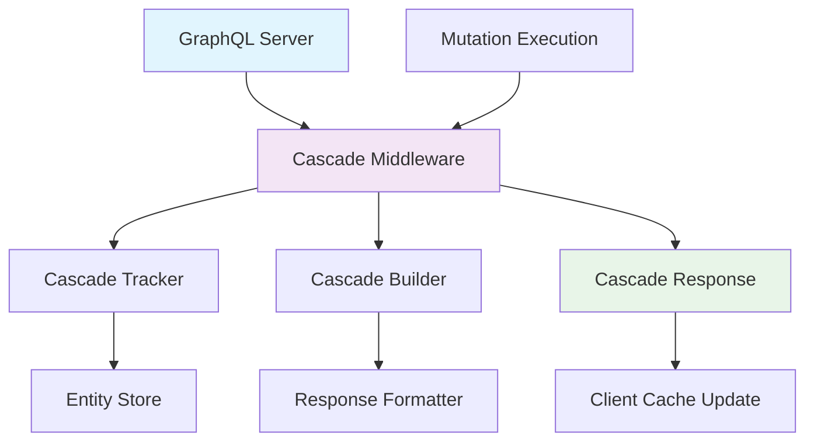
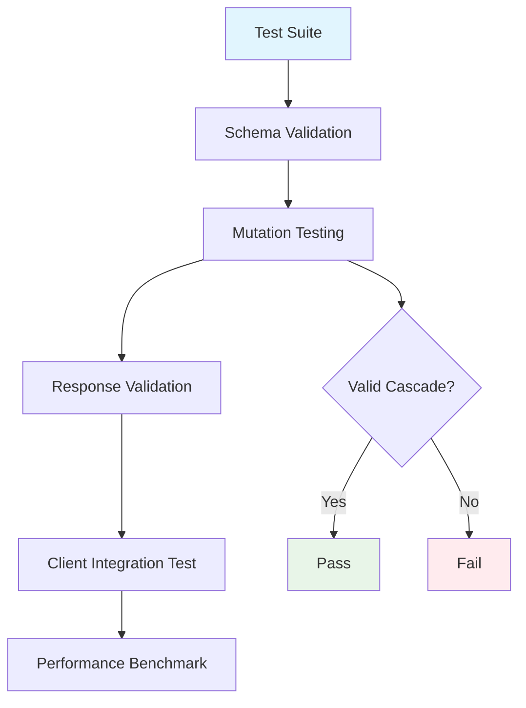

# GraphQL Cascade Reference Implementations

This directory contains reference implementations, compliance test suites, and core schema definitions for GraphQL Cascade. These serve as authoritative examples of how to implement the specification correctly.

## 📚 What's in This Directory

### ✅ Complete Implementations

#### 🐍 Python Server (`server-python/`)
**Status**: ✅ Complete | **Framework**: Python/FraiseQL | **License**: MIT

A full-featured Python reference implementation of GraphQL Cascade server-side logic. This implementation provides:

- **Entity Change Tracking**: Automatic tracking of entity creations, updates, and deletions
- **Relationship Traversal**: Configurable depth limits for cascade traversal
- **Invalidation Hints**: Automatic generation of cache invalidation instructions
- **Framework Integration**: Middleware for Ariadne, Strawberry, and Graphene
- **Performance Controls**: Response size limits and streaming builders
- **Comprehensive Testing**: Full test coverage with pytest

**Key Features:**
- Framework-agnostic core logic
- Configurable cascade behavior
- Memory-efficient streaming for large datasets
- Type-safe Python implementation
- Extensive documentation and examples

**Installation:**
```bash
pip install graphql-cascade
```

**Quick Usage:**
```python
from graphql_cascade import CascadeTracker, CascadeBuilder

tracker = CascadeTracker(max_depth=3)
builder = CascadeBuilder(tracker)

with tracker:
    # Your mutation logic
    user = create_user(name="John")
    tracker.track_create(user)

response = builder.build_response(user)
```

---

### 🚧 Planned Implementations

#### 🟢 Node.js Server (`server-node/`)
**Status**: 🚧 Planned | **Framework**: Node.js/Apollo Server | **License**: MIT

A comprehensive Node.js implementation for Apollo Server and other Node.js GraphQL frameworks.

**Planned Features:**
- Full Apollo Server integration
- TypeScript type definitions
- Middleware for automatic cascade processing
- Entity tracking and invalidation logic
- Performance optimizations for Node.js
- Integration with popular Node.js GraphQL libraries

**Help Needed:** This implementation needs contributors! See [contributing guide](../CONTRIBUTING.md).

---

#### 🧪 Compliance Test Suite (`compliance-suite/`)
**Status**: 🚧 Planned | **Purpose**: Specification Validation | **License**: MIT

A comprehensive test suite for validating implementations against the GraphQL Cascade specification.

**Planned Features:**
- Specification compliance tests
- Cross-implementation compatibility testing
- Performance benchmarks
- Reference implementation validation
- Automated testing framework
- Test case generation tools

**Test Categories:**
- **Core Compliance**: Basic cascade response format
- **Entity Tracking**: Correct entity identification and updates
- **Relationship Handling**: Proper cascade traversal
- **Invalidation Logic**: Correct cache invalidation hints
- **Performance**: Response size and timing limits
- **Error Handling**: Proper error responses

---

## 📋 Core Schema Definitions

### `cascade_base.graphql`
The foundational GraphQL schema that all Cascade-compliant implementations must support.

**Contains:**
- **Core Interfaces**: `Node`, `Timestamped`, `CascadeResponse`
- **Cascade Types**: `CascadeUpdates`, `UpdatedEntity`, `DeletedEntity`
- **Directives**: `@cascade`, `@cascadeInvalidates`
- **Enums**: `CascadeOperation`, `InvalidationStrategy`
- **Error Types**: `CascadeError`, `CascadeErrorCode`

**Usage:**
```graphql
# Import these types into your schema
interface Node {
  id: ID!
}

interface CascadeResponse {
  success: Boolean!
  errors: [CascadeError!]
  data: MutationPayload
  cascade: CascadeUpdates!
}

# Use cascade directive on mutations
type Mutation {
  createUser(input: CreateUserInput!): CreateUserCascade!
    @cascade(maxDepth: 2)
}
```

---

## 🏗️ Architecture Overview

### Reference Implementation Stack



### Compliance Testing Flow



---

## 🎯 Implementation Guidelines

### For Server Implementers

1. **Start with Core Types**: Import `cascade_base.graphql` and implement all interfaces
2. **Implement Tracking**: Build entity change tracking during mutations
3. **Add Relationship Logic**: Traverse entity relationships up to configured depth
4. **Generate Invalidations**: Create cache invalidation hints for clients
5. **Test Compliance**: Use compliance suite to validate implementation

### For Client Library Authors

1. **Parse Cascade Responses**: Extract cascade data from mutation responses
2. **Apply Updates**: Update normalized cache with cascade entities
3. **Handle Deletions**: Evict deleted entities from cache
4. **Process Invalidations**: Apply cache invalidation hints
5. **Test Integration**: Ensure compatibility with reference servers

### For Specification Contributors

1. **Update Base Schema**: Modify `cascade_base.graphql` for spec changes
2. **Update Tests**: Add compliance tests for new requirements
3. **Update Implementations**: Ensure reference implementations reflect changes
4. **Validate Compatibility**: Test all implementations against new spec

---

## 🧪 Testing Your Implementation

### Using the Compliance Suite

```bash
# Run compliance tests against your server
cd reference/compliance-suite
npm install
npm run test -- --endpoint http://localhost:4000/graphql

# Run specific test categories
npm run test -- --category core-compliance
npm run test -- --category performance
```

### Manual Validation

1. **Schema Compliance**: Ensure your schema implements all required interfaces
2. **Mutation Responses**: Verify mutations return proper `CascadeResponse` format
3. **Entity Tracking**: Check that related entities are included in cascades
4. **Client Integration**: Test with reference client implementations
5. **Performance**: Validate response sizes and timing meet requirements

---

## 📊 Implementation Status

| Component | Status | Language | Framework | Completeness |
|-----------|--------|----------|-----------|--------------|
| Python Server | ✅ Complete | Python | Ariadne/Stawberry | 100% |
| Node.js Server | 🚧 Planned | TypeScript | Apollo Server | 0% |
| Compliance Suite | 🚧 Planned | TypeScript | Jest | 10% |
| Base Schema | ✅ Complete | GraphQL | N/A | 100% |

---

## 🤝 Contributing

### Help Build Missing Implementations

We need contributors for:

- **Node.js Server Implementation**: Apollo Server integration
- **Compliance Test Suite**: Comprehensive test framework
- **Additional Language Support**: Go, Rust, Java implementations

### Contribution Process

1. Check [contributing guide](../CONTRIBUTING.md)
2. Review specification requirements
3. Implement against compliance tests
4. Submit pull request with tests
5. Get review and merge

### Testing Contributions

- All implementations must pass compliance suite
- Include comprehensive unit tests
- Provide integration examples
- Document setup and usage

---

## 🔗 Related Resources

- **[Specification](../specification/)** - Formal technical specification
- **[Examples](../examples/)** - Working applications using these implementations
- **[Packages](../packages/)** - Client libraries for these servers
- **[Design](../design/)** - Architecture and design decisions

---

*Reference implementations provide the gold standard for GraphQL Cascade compliance.*
