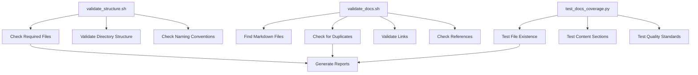
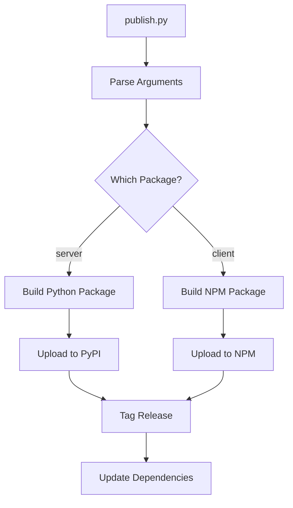

# Automation Scripts

This directory contains automation scripts for maintaining, validating, and publishing the GraphQL Cascade repository. These scripts ensure quality, consistency, and streamline development workflows.

## 📋 Available Scripts

### 🔍 Validation Scripts

#### `validate_docs.py` / `validate_docs.sh`
**Purpose**: Comprehensive documentation validation
**Language**: Python (with shell wrapper)

**Validates:**
- Duplicate content across markdown files
- Broken internal links
- Missing referenced files
- Documentation consistency

**Usage:**
```bash
# Python script
python scripts/validate_docs.py --verbose --generate-reports

# Shell wrapper (recommended)
./scripts/validate_docs.sh -v -g -o reports/
```

**Options:**
- `-v, --verbose`: Enable detailed output
- `-g, --generate-reports`: Create markdown reports
- `-o, --output-dir`: Output directory for reports

---

#### `validate_structure.py` / `validate_structure.sh`
**Purpose**: Repository structure compliance validation
**Language**: Python (with shell wrapper)

**Validates:**
- Required root-level files exist (README.md, LICENSE, etc.)
- Directory structure matches target organization
- Required subdirectory READMEs exist
- File naming conventions

**Usage:**
```bash
# Python script
python scripts/validate_structure.py --verbose --create-stubs

# Shell wrapper
./scripts/validate_structure.sh -v
```

**Options:**
- `-v, --verbose`: Enable detailed output
- `-c, --create-stubs`: Create stub files for missing required files

---

#### `test_docs_coverage.py`
**Purpose**: Documentation completeness testing
**Language**: Python

**Tests:**
- All required documentation files exist
- Files contain required sections
- Critical content is present
- Documentation meets quality standards

**Usage:**
```bash
python scripts/test_docs_coverage.py
```

**Exit Codes:**
- `0`: All tests pass
- `1`: Some tests fail

---

### 📦 Publishing Scripts

#### `publish.py`
**Purpose**: Package publishing automation
**Language**: Python

**Handles:**
- Publishing Python packages to PyPI
- Publishing npm packages to npm registry
- Version management and tagging
- Cross-package dependency updates

**Usage:**
```bash
# Publish all packages
python scripts/publish.py

# Publish specific package
python scripts/publish.py --package server

# Dry run
python scripts/publish.py --dry-run
```

**Supported Packages:**
- `server`: Python server package
- `apollo`: Apollo Client integration
- `react-query`: React Query integration
- `relay`: Relay integration
- `urql`: URQL integration

---

## 🚀 Quick Start

### Daily Development
```bash
# Validate everything before committing
./scripts/validate_docs.sh -v
./scripts/validate_structure.sh -v
python scripts/test_docs_coverage.py
```

### Pre-Release Checklist
```bash
# Comprehensive validation
./scripts/validate_docs.sh -v -g -o release-reports/
./scripts/validate_structure.sh -v
python scripts/test_docs_coverage.py

# Check all reports in release-reports/
```

### Publishing Release
```bash
# Update version numbers
# Run tests
# Validate documentation
./scripts/validate_docs.sh -v

# Publish packages
python scripts/publish.py --dry-run  # Test run first
python scripts/publish.py            # Actual publish
```

---

## 🏗️ Script Architecture

### Validation Pipeline



### Publishing Workflow



---

## 🔧 Development Guidelines

### Adding New Scripts

1. **Include comprehensive documentation** in the script header
2. **Provide both Python and shell versions** for complex scripts
3. **Use consistent argument parsing** (`argparse` for Python, getopts for shell)
4. **Return meaningful exit codes** (0 = success, 1 = failure)
5. **Support verbose mode** for debugging
6. **Generate reports** in markdown format when appropriate

### Script Standards

- **Error handling**: Fail fast with clear error messages
- **Logging**: Use consistent log levels and formats
- **Dependencies**: Minimize external dependencies
- **Cross-platform**: Work on Linux, macOS, and Windows
- **Performance**: Optimize for large repositories

### Testing Scripts

```bash
# Test validation scripts
./scripts/validate_docs.sh -v
./scripts/validate_structure.sh -v

# Test publishing (dry run)
python scripts/publish.py --dry-run

# Test coverage
python scripts/test_docs_coverage.py
```

---

## 📊 Script Status

| Script | Status | Language | Purpose | Complexity |
|--------|--------|----------|---------|------------|
| `validate_docs.py` | ✅ Complete | Python | Doc validation | High |
| `validate_docs.sh` | ✅ Complete | Shell | Doc validation wrapper | Low |
| `validate_structure.py` | ✅ Complete | Python | Structure validation | Medium |
| `validate_structure.sh` | ✅ Complete | Shell | Structure validation wrapper | Low |
| `test_docs_coverage.py` | ✅ Complete | Python | Coverage testing | Medium |
| `publish.py` | ✅ Complete | Python | Package publishing | High |

---

## 🤝 Contributing

### Improving Scripts

1. **Test changes thoroughly** before submitting
2. **Update documentation** when modifying behavior
3. **Maintain backward compatibility** for command-line interfaces
4. **Add tests** for new functionality

### Adding Scripts

1. **Follow naming conventions** (descriptive, lowercase with underscores)
2. **Include comprehensive help** and usage examples
3. **Add to this README** with clear description
4. **Test on multiple platforms** if applicable

### Reporting Issues

- **Script failures**: Include full command and error output
- **Performance issues**: Include timing information
- **Feature requests**: Describe the use case and expected behavior

---

## 🔗 Related Documentation

- **[Contributing Guide](../CONTRIBUTING.md)** - How to contribute to the project
- **[Repository Cleanup Plan](../REPOSITORY_CLEANUP_PLAN.md)** - Overall repository organization
- **[CI/CD Workflows](../.github/workflows/)** - Automated validation in CI

---

*Automation scripts ensure GraphQL Cascade maintains high quality and consistency.*</content>
</xai:function_call">Scripts/README.md