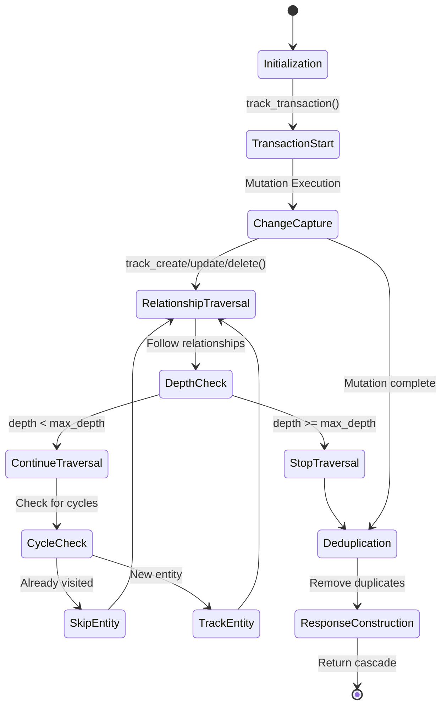

# Entity Tracking Algorithm

This document specifies the algorithm for tracking entity changes during GraphQL mutations.

## Overview

The entity tracking algorithm captures all database changes that occur during a mutation and builds the cascade of affected entities. This enables automatic cache updates on the client side.

## Core Algorithm

### Tracking Lifecycle



1. **Initialization**: Create tracker instance for the mutation
2. **Change Capture**: Record all entity changes during execution
3. **Relationship Traversal**: Follow relationships to find indirectly affected entities
4. **Deduplication**: Remove duplicate entity references
5. **Response Construction**: Build the final cascade structure

### Algorithm Flow

```python
class CascadeTracker:
    def __init__(self, max_depth=3, exclude_types=None):
        self.max_depth = max_depth
        self.exclude_types = set(exclude_types or [])
        self.current_transaction = None

        # Tracking storage
        self.updated_entities = {}  # (typename, id) -> (entity, operation)
        self.deleted_entities = set()  # (typename, id)
        self.visited = set()  # Prevent cycles
        self.current_depth = 0

    def track_transaction(self):
        """Context manager for transaction tracking."""
        return CascadeTransaction(self)

    def track_create(self, entity):
        """Track entity creation."""
        self._track_entity(entity, CascadeOperation.CREATED)

    def track_update(self, entity):
        """Track entity update."""
        self._track_entity(entity, CascadeOperation.UPDATED)

    def track_delete(self, typename, entity_id):
        """Track entity deletion."""
        key = (typename, entity_id)
        self.deleted_entities.add(key)

        # Remove from updated if it was there
        self.updated_entities.pop(key, None)

    def _track_entity(self, entity, operation):
        """Internal entity tracking with relationship traversal."""
        typename = entity.__typename__
        entity_id = entity.id
        key = (typename, entity_id)

        # Skip excluded types
        if typename in self.exclude_types:
            return

        # Skip if already visited in this cascade
        if key in self.visited:
            return

        self.visited.add(key)

        # Store the entity change
        self.updated_entities[key] = (entity, operation)

        # Traverse relationships if within depth limit
        if self.current_depth < self.max_depth:
            self._traverse_relationships(entity, operation)

    def _traverse_relationships(self, entity, operation):
        """Traverse entity relationships to find cascade effects."""
        self.current_depth += 1

        try:
            for related_entity in entity.get_related_entities():
                # Related entities are typically UPDATED (not CREATED/DELETED)
                # unless the relationship itself creates/deletes them
                self._track_entity(related_entity, CascadeOperation.UPDATED)
        finally:
            self.current_depth -= 1

    def get_cascade_data(self):
        """Get the final cascade data for response construction."""
        updated = []
        for (typename, entity_id), (entity, operation) in self.updated_entities.items():
            updated.append({
                '__typename': typename,
                'id': entity_id,
                'operation': operation.value,
                'entity': entity.to_dict()
            })

        deleted = []
        for typename, entity_id in self.deleted_entities:
            deleted.append({
                '__typename': typename,
                'id': entity_id,
                'deletedAt': self.transaction_timestamp
            })

        return {
            'updated': updated,
            'deleted': deleted,
            'metadata': {
                'depth': self.current_depth,
                'affectedCount': len(updated) + len(deleted)
            }
        }
```

## Tracking Strategies

### ORM Hooks Strategy (Preferred)

For ORMs like SQLAlchemy, Django ORM, or Prisma:

```python
class ORMHookTracker(CascadeTracker):
    def __init__(self, orm_session, *args, **kwargs):
        super().__init__(*args, **kwargs)
        self.orm_session = orm_session
        self._install_hooks()

    def _install_hooks(self):
        """Install ORM event hooks."""
        # SQLAlchemy-style hooks
        from sqlalchemy import event

        @event.listens_for(self.orm_session, 'after_insert')
        def track_insert(mapper, connection, target):
            self.track_create(target)

        @event.listens_for(self.orm_session, 'after_update')
        def track_update(mapper, connection, target):
            self.track_update(target)

        @event.listens_for(self.orm_session, 'after_delete')
        def track_delete(mapper, connection, target):
            self.track_delete(target.__class__.__name__, target.id)
```

### Database Trigger Strategy

For databases supporting triggers (PostgreSQL, MySQL):

```sql
-- Create tracking table
CREATE TABLE cascade_changes (
    transaction_id UUID,
    entity_type VARCHAR(255),
    entity_id VARCHAR(255),
    operation VARCHAR(50),
    changed_at TIMESTAMP DEFAULT NOW()
);

-- Create triggers
CREATE OR REPLACE FUNCTION track_entity_change()
RETURNS TRIGGER AS $$
BEGIN
    INSERT INTO cascade_changes (transaction_id, entity_type, entity_id, operation)
    VALUES (txid_current(), TG_TABLE_NAME, NEW.id, TG_OP);
    RETURN NEW;
END;
$$ LANGUAGE plpgsql;

-- Attach to tables
CREATE TRIGGER users_cascade_trigger
    AFTER INSERT OR UPDATE OR DELETE ON users
    FOR EACH ROW EXECUTE FUNCTION track_entity_change();
```

```python
class TriggerBasedTracker(CascadeTracker):
    def __init__(self, database_connection, transaction_id, *args, **kwargs):
        super().__init__(*args, **kwargs)
        self.db = database_connection
        self.transaction_id = transaction_id

    def get_cascade_data(self):
        """Read changes from tracking table."""
        changes = self.db.execute("""
            SELECT entity_type, entity_id, operation
            FROM cascade_changes
            WHERE transaction_id = ?
            ORDER BY changed_at
        """, [self.transaction_id])

        # Process changes into cascade format
        # ... implementation details
```

### Manual Tracking Strategy

For explicit tracking in resolvers:

```python
class ManualTracker(CascadeTracker):
    def __init__(self, *args, **kwargs):
        super().__init__(*args, **kwargs)

    # Used explicitly in mutation resolvers
    # tracker.track_create(user)
    # tracker.track_update(company)
    # tracker.track_delete('Order', order_id)
```

## Relationship Traversal

### Traversal Rules

1. **Depth Limiting**: Stop at configured maximum depth
2. **Cycle Prevention**: Don't revisit entities in same cascade
3. **Type Exclusion**: Skip excluded entity types
4. **Operation Propagation**: Related entities typically UPDATED

### Relationship Types

#### One-to-One Relationships
```python
class User:
    def get_related_entities(self):
        related = []
        if self.profile:
            related.append(self.profile)
        if self.address:
            related.append(self.address)
        return related
```

#### One-to-Many Relationships
```python
class Company:
    def get_related_entities(self):
        related = []
        related.extend(self.employees)  # All employees
        if self.address:
            related.append(self.address)
        return related
```

#### Many-to-Many Relationships
```python
class Order:
    def get_related_entities(self):
        related = []
        related.append(self.customer)  # Customer
        # Order items and products
        for item in self.items:
            related.append(item.product)
        return related
```

### Lazy Loading Considerations

For performance, implement lazy relationship loading:

```python
class LazyRelationshipTracker:
    def _traverse_relationships(self, entity, operation):
        """Lazy loading of relationships."""
        self.current_depth += 1

        try:
            # Only load relationships that haven't been loaded
            if not hasattr(entity, '_related_loaded'):
                entity.load_related()  # Bulk load related entities
                entity._related_loaded = True

            for related_entity in entity.get_related_entities():
                self._track_entity(related_entity, CascadeOperation.UPDATED)
        finally:
            self.current_depth -= 1
```

## Performance Optimizations

### Memory Management

1. **Streaming Processing**: Don't load all entities into memory
2. **Batch Loading**: Use database JOINs for relationship traversal
3. **Garbage Collection**: Clean up tracking data after response construction

### Database Optimization

1. **Index Usage**: Ensure foreign key indexes exist
2. **Query Batching**: Use single queries with JOINs
3. **Connection Reuse**: Reuse database connections

### Caching

1. **Entity Metadata**: Cache entity type information
2. **Relationship Maps**: Cache relationship definitions
3. **Query Plans**: Cache optimized traversal queries

## Error Handling

### Tracking Errors

Handle tracking failures gracefully:

```python
class ResilientTracker(CascadeTracker):
    def _track_entity(self, entity, operation):
        try:
            super()._track_entity(entity, operation)
        except Exception as e:
            # Log error but continue tracking
            logger.warning(f"Failed to track entity {entity}: {e}")
            # Don't re-raise - tracking failures shouldn't break mutations
```

### Validation

Validate tracking data:

```python
def validate_cascade_data(cascade_data):
    """Validate cascade data integrity."""
    # Check for duplicate entities
    seen = set()
    for entity in cascade_data['updated']:
        key = (entity['__typename'], entity['id'])
        if key in seen:
            raise ValueError(f"Duplicate entity in cascade: {key}")
        seen.add(key)

    # Check for entities in both updated and deleted
    deleted_keys = {(e['__typename'], e['id']) for e in cascade_data['deleted']}
    overlap = seen & deleted_keys
    if overlap:
        raise ValueError(f"Entities in both updated and deleted: {overlap}")

    return True
```

## Testing the Algorithm

### Unit Tests

```python
def test_basic_tracking():
    tracker = CascadeTracker()

    user = User(id="123", name="John")
    tracker.track_create(user)

    cascade = tracker.get_cascade_data()
    assert len(cascade['updated']) == 1
    assert cascade['updated'][0]['operation'] == 'CREATED'

def test_relationship_traversal():
    tracker = CascadeTracker(max_depth=2)

    company = Company(id="456", name="ACME")
    user = User(id="123", name="John", company=company)
    tracker.track_update(user)

    cascade = tracker.get_cascade_data()
    # Should include both user and company
    assert len(cascade['updated']) == 2

def test_depth_limiting():
    tracker = CascadeTracker(max_depth=1)

    # Deep relationship chain: A -> B -> C -> D
    d = Entity(id="4", name="D")
    c = Entity(id="3", name="C", related=[d])
    b = Entity(id="2", name="B", related=[c])
    a = Entity(id="1", name="A", related=[b])

    tracker.track_update(a)

    cascade = tracker.get_cascade_data()
    # Should only go to depth 1: A, B
    assert len(cascade['updated']) == 2
```

### Integration Tests

```python
def test_full_mutation_tracking():
    # Simulate a complex mutation
    with tracker.track_transaction():
        # Create user
        user = create_user_in_db({"name": "John"})

        # Update company
        company = update_company_in_db(user.company_id, {"name": "New Name"})

        # Delete old address
        delete_address_in_db(company.old_address_id)

    cascade = tracker.get_cascade_data()

    # Verify all changes captured
    assert len(cascade['updated']) >= 2  # user + company
    assert len(cascade['deleted']) >= 1  # address
```

### Performance Tests

```python
def test_tracking_performance():
    tracker = CascadeTracker()

    # Create many entities
    entities = [User(id=str(i), name=f"User{i}") for i in range(1000)]

    start_time = time.time()
    for entity in entities:
        tracker.track_create(entity)

    cascade = tracker.get_cascade_data()
    end_time = time.time()

    # Should complete quickly
    assert end_time - start_time < 0.1  # 100ms
    assert len(cascade['updated']) == 1000
```

This tracking algorithm provides a robust, performant foundation for GraphQL Cascade entity change detection across different server architectures and database systems.