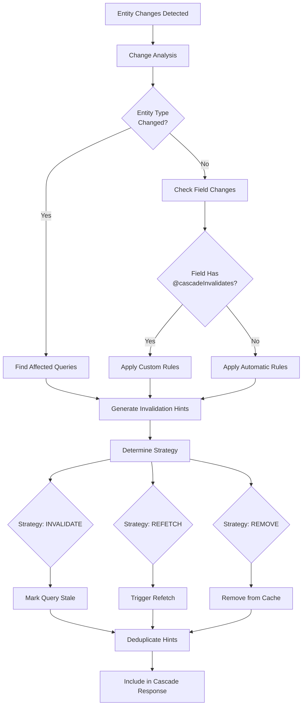

# Invalidation Algorithm

This document specifies the algorithm for generating cache invalidation hints in GraphQL Cascade.

## Overview

The invalidation algorithm analyzes entity changes and generates cache invalidation instructions that tell clients which cached queries need to be updated, refetched, or removed.

## Core Algorithm

### Invalidation Generation Flow



1. **Change Analysis**: Analyze which entities and fields changed
2. **Rule Application**: Apply invalidation rules (automatic + custom)
3. **Hint Generation**: Generate invalidation hints with strategies
4. **Optimization**: Deduplicate and optimize hints
5. **Response Integration**: Include hints in cascade response

### Algorithm Structure

```python
class CascadeInvalidator:
    def __init__(self, schema, config):
        self.schema = schema
        self.config = config
        self.invalidation_rules = self._load_custom_rules()

    def compute_invalidations(self, updated_entities, deleted_entities, primary_result):
        """
        Compute invalidation hints for entity changes.

        Args:
            updated_entities: List of UpdatedEntity
            deleted_entities: List of DeletedEntity
            primary_result: Primary mutation result

        Returns:
            List[QueryInvalidation]: Cache invalidation hints
        """
        invalidations = []

        # 1. Automatic invalidations based on entity types
        invalidations.extend(self._compute_automatic_invalidations(
            updated_entities, deleted_entities
        ))

        # 2. Custom invalidations from @cascadeInvalidates directives
        invalidations.extend(self._compute_custom_invalidations(
            updated_entities, deleted_entities
        ))

        # 3. Primary result invalidations
        invalidations.extend(self._compute_primary_invalidations(primary_result))

        # 4. Optimize and deduplicate
        optimized = self._optimize_invalidations(invalidations)

        return optimized

    def _compute_automatic_invalidations(self, updated, deleted):
        """Generate automatic invalidations based on entity types."""
        invalidations = []
        affected_types = set()

        # Collect all affected entity types
        for entity in updated:
            affected_types.add(entity['__typename'])
        for entity in deleted:
            affected_types.add(entity['__typename'])

        # Generate invalidations for each type
        for entity_type in affected_types:
            invalidations.extend(self._get_type_invalidations(entity_type))

        return invalidations

    def _get_type_invalidations(self, entity_type):
        """Get standard invalidations for an entity type."""
        return [
            {
                'queryName': f'list{entity_type}s',
                'strategy': 'INVALIDATE',
                'scope': 'PREFIX'
            },
            {
                'queryName': f'get{entity_type}',
                'strategy': 'REFETCH',
                'scope': 'EXACT'
            },
            {
                'queryPattern': f'search{entity_type}*',
                'strategy': 'INVALIDATE',
                'scope': 'PATTERN'
            }
        ]

    def _compute_custom_invalidations(self, updated, deleted):
        """Generate invalidations from @cascadeInvalidates directives."""
        invalidations = []

        for entity in updated:
            entity_type = entity['__typename']
            entity_data = entity['entity']

            # Get changed fields (simplified - would need entity diffing)
            changed_fields = self._get_changed_fields(entity)

            # Apply rules for changed fields
            for field_name in changed_fields:
                rules = self.invalidation_rules.get(entity_type, {}).get(field_name, [])
                for rule in rules:
                    invalidations.append({
                        'queryName': rule['query'],
                        'strategy': rule.get('strategy', 'INVALIDATE'),
                        'scope': rule.get('scope', 'PREFIX'),
                        'arguments': rule.get('arguments')
                    })

        return invalidations

    def _compute_primary_invalidations(self, primary_result):
        """Generate invalidations for the primary mutation result."""
        if not primary_result:
            return []

        # Invalidate get query for primary result
        return [{
            'queryName': f'get{primary_result.__class__.__name__}',
            'arguments': {'id': primary_result.id},
            'strategy': 'REFETCH',
            'scope': 'EXACT'
        }]

    def _optimize_invalidations(self, invalidations):
        """Optimize and deduplicate invalidation hints."""
        # Remove duplicates
        seen = set()
        deduplicated = []

        for inv in invalidations:
            # Create hash for deduplication
            inv_hash = (
                inv.get('queryName'),
                inv.get('queryPattern'),
                inv.get('strategy'),
                inv.get('scope'),
                str(inv.get('arguments'))
            )

            if inv_hash not in seen:
                seen.add(inv_hash)
                deduplicated.append(inv)

        # Apply scope precedence (EXACT > PREFIX > PATTERN > ALL)
        def scope_priority(scope):
            return {'EXACT': 4, 'PREFIX': 3, 'PATTERN': 2, 'ALL': 1}.get(scope, 0)

        deduplicated.sort(key=lambda x: scope_priority(x.get('scope', 'PREFIX')), reverse=True)

        # Limit total invalidations
        max_invalidations = self.config.get('max_invalidations', 50)
        return deduplicated[:max_invalidations]

    def _get_changed_fields(self, entity):
        """Determine which fields changed in an entity (simplified)."""
        # In practice, this would compare entity to its previous state
        # For now, assume all fields might have changed
        return list(entity['entity'].keys())
```

## Invalidation Rules

### Automatic Rules

The algorithm applies these automatic rules:

#### Entity Type Rules
- **List Queries**: `list{EntityType}s` - INVALIDATE with PREFIX scope
- **Get Queries**: `get{EntityType}` - REFETCH with EXACT scope
- **Search Queries**: `search{EntityType}*` - INVALIDATE with PATTERN scope

#### Relationship Rules
When an entity changes, invalidate queries for related entities:

```python
def _compute_relationship_invalidations(self, entity):
    """Invalidate queries for related entities."""
    invalidations = []

    for related_entity in entity.get_related_entities():
        related_type = related_entity.__class__.__name__

        invalidations.append({
            'queryName': f'list{related_type}s',
            'strategy': 'INVALIDATE',
            'scope': 'PREFIX'
        })

    return invalidations
```

### Custom Rules

Custom rules come from `@cascadeInvalidates` directives:

```python
def _load_custom_rules(self):
    """Load invalidation rules from schema directives."""
    rules = {}

    # Parse schema and extract @cascadeInvalidates directives
    for type_def in self.schema.get_type_map().values():
        if not hasattr(type_def, 'fields'):
            continue

        for field_def in type_def.fields.values():
            directive = self._get_cascade_invalidates_directive(field_def)
            if directive:
                entity_type = type_def.name
                field_name = field_def.name

                if entity_type not in rules:
                    rules[entity_type] = {}
                if field_name not in rules[entity_type]:
                    rules[entity_type][field_name] = []

                rules[entity_type][field_name].append({
                    'query': directive['queries'],
                    'strategy': directive.get('strategy', 'INVALIDATE'),
                    'scope': directive.get('scope', 'PREFIX'),
                    'arguments': directive.get('arguments')
                })

    return rules
```

## Invalidation Strategies

### INVALIDATE Strategy
Mark queries as stale, refetch on next access.

**Algorithm:**
```python
def apply_invalidate(invalidation):
    """Apply INVALIDATE strategy."""
    query_key = build_query_key(invalidation)

    # Mark as stale without immediate refetch
    cache.mark_stale(query_key)

    # Client will refetch when next accessed
```

**Use cases:**
- List queries that can tolerate slight staleness
- Non-critical data
- Reducing network requests

### REFETCH Strategy
Immediately refetch affected queries.

**Algorithm:**
```python
async def apply_refetch(invalidation):
    """Apply REFETCH strategy."""
    query_key = build_query_key(invalidation)

    # Immediately refetch
    await cache.refetch(query_key)
```

**Use cases:**
- Currently visible data
- Critical updates
- Real-time requirements

### REMOVE Strategy
Remove queries from cache entirely.

**Algorithm:**
```python
def apply_remove(invalidation):
    """Apply REMOVE strategy."""
    query_key = build_query_key(invalidation)

    # Remove from cache
    cache.remove(query_key)
```

**Use cases:**
- Structural changes
- Invalid queries
- Cache cleanup

## Scope Handling

### EXACT Scope
Only invalidate queries with exact name and arguments.

**Matching algorithm:**
```python
def matches_exact(invalidation, query):
    """Check if query matches EXACT scope."""
    if invalidation.get('queryName') != query.name:
        return False

    if invalidation.get('arguments'):
        return arguments_match(invalidation['arguments'], query.variables)

    return True
```

### PREFIX Scope
Invalidate queries with names matching prefix.

**Matching algorithm:**
```python
def matches_prefix(invalidation, query):
    """Check if query matches PREFIX scope."""
    prefix = invalidation.get('queryName', '')
    return query.name.startswith(prefix)
```

### PATTERN Scope
Invalidate queries matching glob pattern.

**Matching algorithm:**
```python
def matches_pattern(invalidation, query):
    """Check if query matches PATTERN scope."""
    pattern = invalidation.get('queryPattern', '')
    return fnmatch(query.name, pattern)
```

### ALL Scope
Invalidate all queries.

**Matching algorithm:**
```python
def matches_all(invalidation, query):
    """ALL scope matches everything."""
    return True
```

## Optimization Techniques

### Deduplication
Remove duplicate invalidations:

```python
def deduplicate_invalidations(invalidations):
    """Remove duplicate invalidations."""
    seen = set()
    deduplicated = []

    for inv in invalidations:
        # Create unique key
        key = (
            inv.get('queryName'),
            inv.get('queryPattern'),
            inv.get('strategy'),
            inv.get('scope'),
            json.dumps(inv.get('arguments'), sort_keys=True)
        )

        if key not in seen:
            seen.add(key)
            deduplicated.append(inv)

    return deduplicated
```

### Prioritization
Apply more specific invalidations first:

```python
def prioritize_invalidations(invalidations):
    """Sort invalidations by specificity."""
    scope_priority = {
        'EXACT': 4,
        'PREFIX': 3,
        'PATTERN': 2,
        'ALL': 1
    }

    return sorted(
        invalidations,
        key=lambda x: scope_priority.get(x.get('scope', 'PREFIX'), 0),
        reverse=True
    )
```

### Batching
Group similar invalidations:

```python
def batch_invalidations(invalidations):
    """Batch similar invalidations."""
    batches = {}

    for inv in invalidations:
        # Group by strategy and scope
        key = (inv.get('strategy'), inv.get('scope'))

        if key not in batches:
            batches[key] = []

        batches[key].append(inv)

    # Process batches efficiently
    for (strategy, scope), batch in batches.items():
        if strategy == 'INVALIDATE' and scope == 'PREFIX':
            # Batch prefix invalidations
            self._batch_prefix_invalidations(batch)
```

## Performance Considerations

### Computational Complexity
- **Entity Analysis**: O(n) where n = number of changed entities
- **Rule Application**: O(m * r) where m = changed fields, r = rules per field
- **Optimization**: O(i log i) where i = number of invalidations

### Memory Usage
- **Rule Storage**: Cache parsed invalidation rules
- **Hint Generation**: Stream processing for large cascades
- **Deduplication**: Use sets for efficient duplicate detection

### Database Impact
- **Rule Loading**: Load invalidation rules once at startup
- **Query Analysis**: Minimal additional database queries

## Error Handling

### Invalid Rules
Handle invalid invalidation rules:

```python
def validate_invalidation_rule(rule):
    """Validate an invalidation rule."""
    required_fields = ['query']
    for field in required_fields:
        if field not in rule:
            raise ValueError(f"Missing required field: {field}")

    if rule.get('strategy') not in ['INVALIDATE', 'REFETCH', 'REMOVE']:
        raise ValueError(f"Invalid strategy: {rule.get('strategy')}")

    if rule.get('scope') not in ['EXACT', 'PREFIX', 'PATTERN', 'ALL']:
        raise ValueError(f"Invalid scope: {rule.get('scope')}")
```

### Fallback Behavior
Provide fallbacks for invalidation failures:

```python
def safe_compute_invalidations(self, *args, **kwargs):
    """Compute invalidations with error handling."""
    try:
        return self.compute_invalidations(*args, **kwargs)
    except Exception as e:
        logger.warning(f"Invalidation computation failed: {e}")
        # Return conservative fallback
        return [{
            'strategy': 'INVALIDATE',
            'scope': 'ALL'
        }]
```

## Testing the Algorithm

### Unit Tests

```python
def test_automatic_invalidations():
    invalidator = CascadeInvalidator(schema, config)

    updated = [{'__typename': 'User', 'id': '123', 'entity': {}}]
    deleted = []

    hints = invalidator.compute_invalidations(updated, deleted, None)

    # Should include listUsers, getUser, searchUser* invalidations
    assert any(h['queryName'] == 'listUsers' for h in hints)
    assert any(h['queryName'] == 'getUser' for h in hints)

def test_custom_invalidations():
    # Schema with @cascadeInvalidates directive
    schema = build_schema_with_directives()

    invalidator = CascadeInvalidator(schema, config)

    # Entity with changed field that has directive
    updated = [{
        '__typename': 'Company',
        'id': '456',
        'entity': {'name': 'New Name'}
    }]

    hints = invalidator.compute_invalidations(updated, [], None)

    # Should include custom invalidations from directive
    assert any(h['queryName'] == 'searchCompanies' for h in hints)

def test_optimization():
    invalidator = CascadeInvalidator(schema, config)

    # Create duplicate invalidations
    hints = [
        {'queryName': 'listUsers', 'strategy': 'INVALIDATE', 'scope': 'PREFIX'},
        {'queryName': 'listUsers', 'strategy': 'INVALIDATE', 'scope': 'PREFIX'},
        {'queryName': 'getUser', 'strategy': 'REFETCH', 'scope': 'EXACT'},
    ]

    optimized = invalidator._optimize_invalidations(hints)

    # Should deduplicate
    assert len(optimized) == 2
```

### Integration Tests

```python
def test_full_invalidation_flow():
    # Simulate schema with directives
    schema = """
    type Company {
      name: String! @cascadeInvalidates(queries: ["searchCompanies"])
      employees: [User!]!
    }
    """

    invalidator = CascadeInvalidator(schema, config)

    # Company name change
    updated = [{
        '__typename': 'Company',
        'id': '123',
        'entity': {'name': 'New Name'}
    }]

    hints = invalidator.compute_invalidations(updated, [], None)

    # Should include both automatic and custom invalidations
    expected_queries = {'listCompanies', 'getCompany', 'searchCompanies'}
    actual_queries = {h.get('queryName') for h in hints if 'queryName' in h}

    assert expected_queries.issubset(actual_queries)
```

This invalidation algorithm provides intelligent, configurable cache invalidation that balances correctness with performance across different GraphQL client architectures.